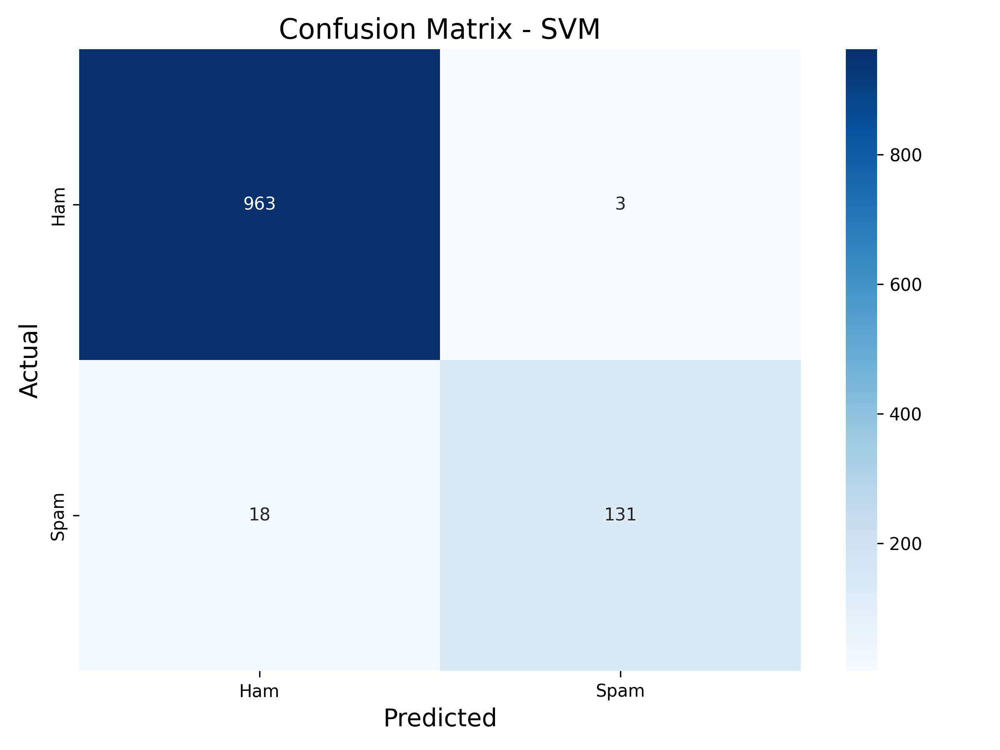

# AI-ML_02_SpamSMSClassifier_byte
# 📱 Spam SMS / Email Classifier

> A machine learning system that detects spam messages with 98%+ accuracy using Natural Language Processing and multiple classification algorithms.

---

## 📊 Model Performance

### Best Model: **Logistic Regression**

| Metric | Score |
|--------|-------|
| **Accuracy** | 98.2% |
| **Precision (Spam)** | 0.97 |
| **Recall (Spam)** | 0.96 |
| **F1-Score (Spam)** | 0.97 |
| **AUC-ROC** | 0.99 |

### Confusion Matrix

  

### Classification Report
